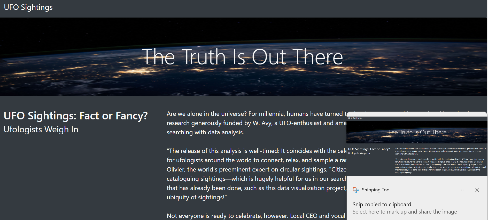
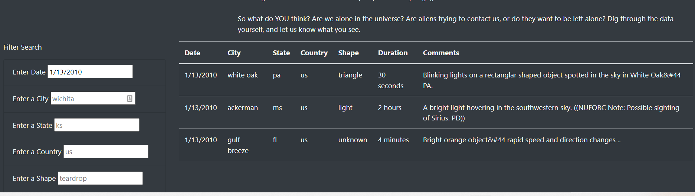
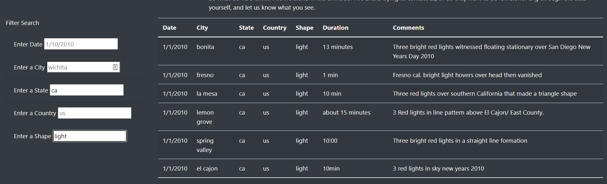

# UFO Sightings Analysis

## Overview

In this project, I used Javascript to display a large amount UFO sightings data. 
Easy to use filters allow users to interact with the data, refining the displayed sightings. 
The HTML page is customized to be aesthetically pleasing using Bootstrap.

## Results

### User Greeting

A potential user is greeted with a polished header, banner and the news story you selected for display,
divided into neat tables using bootstrap. 

### Filtering

Below, users can search for specific types of UFO sightings using one or more filters. The filters are
loaded with placeholders that guide users on how to enter search terms. For example, users can enter a 
single filter condition, like a specific date (1/13/2010) and press "Enter" to see only UFO sightings 
from that date.

Users can also enter multiple filters to narrow their view in useful ways. For example, if a user
wanted to see only sightings from California with "light" as its description, they could enter "ca" into
the state filter and "light" into the shape filter, as seen below:

## Summary

In summary, this website uses to Javascript, HTML, and Bootstrap to provide easy and visually polished exploration of the available UFO sighting data. 

### Drawbacks

	* One drawback of the current project is that it requires users to enter filter criteria in the correct format. For example:
		* For the state field, it must be entered as an abbreviation in lower case. 
		* For the shape field, users must know the possible "shapes" and enter and spell them correctly.
	
	* Another drawback as that it does not provide summary visualizations of the data. Rather, users must look at the observations row by row, making it
	hard to draw any broad conclusions.

### Additional Reccomendations
	
	* Map the UFO data using Google API or Tableau. Both heatmaps and maps with markers for sightings, perhaps color coded by shape, would provide an 
	interesting analysis. 

	* Use Unsupervised Machine Learning to identify clusters in the UFO sightings, which might indicate a particular kind of UFO or alien species. 

